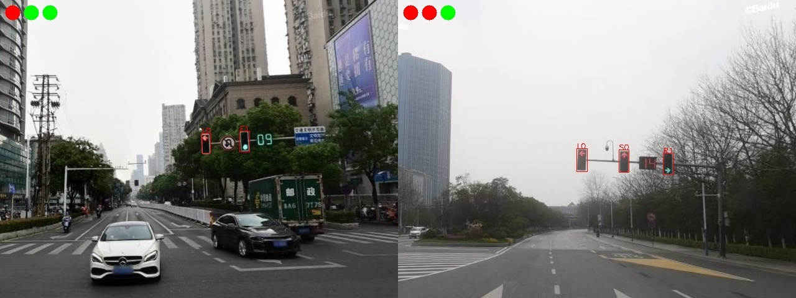

# Traffic Rules

*<u>v2.0.0 新变化：使用 YOLO11 以及一个更加丰富的数据集训练模型，对原来目标检测和信号分类两个步骤进行整合，去除了在大部分情况下冗余的过滤筛选，实现交通信号灯识别一步到位，得到的模型识别准确率和推理效率均有少量的提升，且更加易于部署。</u>*

## 项目简介

本项目为基于 YOLO11 的路口交通信号灯通行规则识别，其中通行规则识别分为以下两个步骤：

1. **目标检测**，采用 YOLO11 目标检测模型，识别图像中交通信号灯的位置、颜色以及形状（包括圆形、左箭头、上箭头和右箭头）。

2. **规则解析**，对图像中检测出来的交通信号灯，解析其表示的通行规则（即能否直行、能否左转和能否右转）。
   
   - 圆形的信号灯能够控制三个方向的通行规则，优先级较低。
   
   - 箭头形的信号灯仅能控制对应方向的通行规则，但优先级较高。
   
   此外，若无明确信号，即没有红色的右箭头信号灯，右转默认视为允许通行。

## 效果展示



## 性能评估

模型的输入尺寸固定为 640x480，在此图像输入下，采用 PyTorch 平均推理一张图片的耗时约为 50ms，采用 ONNX Runtime 推理平均耗时约为 40ms（CPU：11th Intel Core i5-1155G7 2.50GHz，Model：YOLO11n）。

在当前数据集下信号灯目标检测准确性指标：

| Class | Precision | Recall | mAP50 | mAP50-95 |
| ----- | --------- | ------ | ----- | -------- |
| ALL   | 0.97      | 0.971  | 0.989 | 0.89     |
| F0    | 0.99      | 1      | 0.995 | 0.871    |
| F1    | 1         | 0.981  | 0.995 | 0.872    |
| L0    | 0.981     | 0.985  | 0.994 | 0.912    |
| L1    | 0.982     | 1      | 0.995 | 0.915    |
| S0    | 1         | 0.817  | 0.944 | 0.878    |
| S1    | 1         | 0.987  | 0.995 | 0.885    |
| R0    | 0.815     | 1      | 0.995 | 0.914    |
| R1    | 0.993     | 1      | 0.995 | 0.876    |

*<u>注：本项目训练用的数据集规模较小，在真实环境下的鲁棒性可能不够理想。</u>*

## 使用说明

首先需要安装环境依赖包，本项目目前采用 ONNX Runtime 部署模型推理，如果对 Execution Provider 有特殊需求，请参阅 [官方文档](https://onnxruntime.ai/docs/execution-providers/) 进行配置，同时按需更改识别程序的配置文件。

```shell-session
pip install -r requirements.txt
```

准备好待识别图像，识别程序接受的图像尺寸为 640x480，在本项目 Releases 中下载我训练好的模型权重文件，解压到 "inferences/models" 目录下，运行主程序 main.py 即可。

```shell-session
python main.py --sources "1.jpg" "2.jpg" --outputs "1.jpg" "2.jpg"
```

其中命令行参数的含义如下，输入图像文件路径数量需要和输出图像文件路径数量保持一致：

| 参数名       | 简化参数名 | 参数描述                       | 参数值示例             |
|:---------:|:-----:|:--------------------------:|:-----------------:|
| --sources | -s    | 输入预测图像文件路径序列，不同的文件路径以空格分隔。 | 1.jpg 2.jpg 3.jpg |
| --outputs | -o    | 输出结果图像文件路径序列，不同的文件路径以空格分隔。 | 1.jpg 2.jpg 3.jpg |

本项目的识别程序被设计为一个即插即用的 Python 模块。可以将 inferences 模块完整拷贝到项目根目录下，如果名称与项目中原有的内容冲突也可以更改模块名，同时配置好环境并安装好相关的依赖，参考 main.py 中的调用方式，即可为项目添加通行规则识别的功能。

本项目的通行规则识别模块默认的配置文件为 "inferences/configs/config.toml"，其中各个属性描述如下：

| 属性名            | 描述                                       |
|:--------------:|:----------------------------------------:|
| precision      | 推理运算精度，可取 "fp32"（单精度）或 "fp16"（半精度）       |
| providers      | 模型推理 ONNX Runtime Execution Providers 列表 |
| conf-threshold | 目标检测置信度阈值                                |
| iou-threshold  | 目标检测非极大值抑制 IoU 阈值                        |
| model-path     | 推理模型加载路径                                 |

此外，如果需要使用自己的数据集训练模型，则需要安装 ultralytics 框架，参照 [Ultralytics 官方文档](https://docs.ultralytics.com/) 进行模型的训练，最后将模型转换为 ONNX 格式进行部署即可。

```shell-session
pip install ultralytics
```
